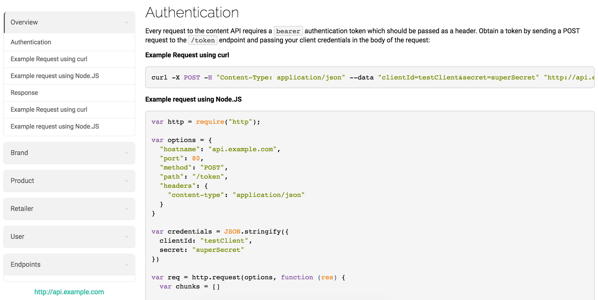
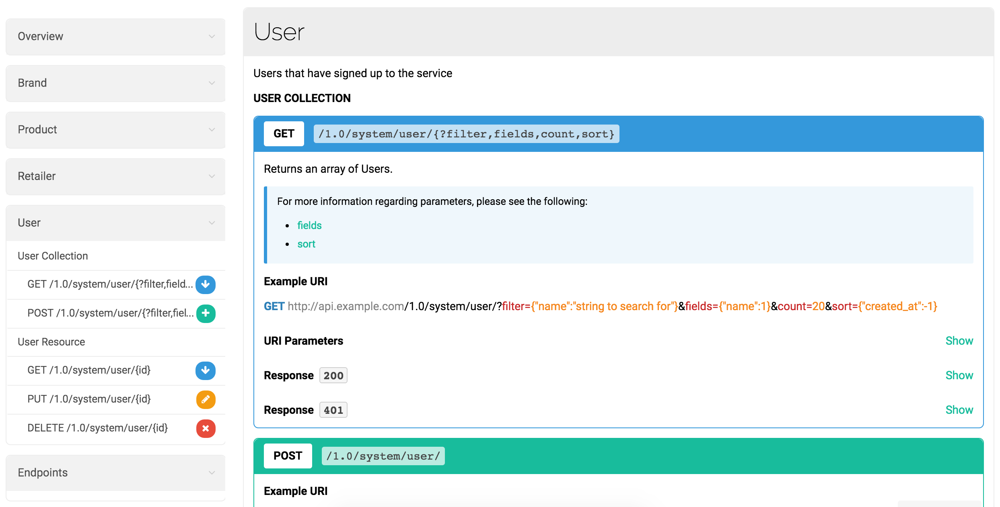
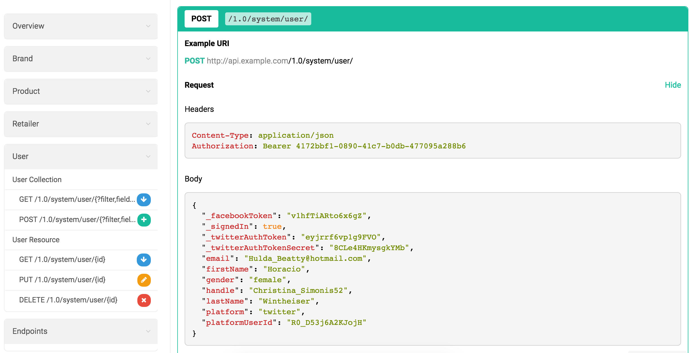

# DADI API Documentation

[](https://www.npmjs.com/package/@dadi/apidoc)
[](http://standardjs.com/)

> API documentation middleware for DADI API

* [Introduction](#introduction)
* [Installation](#installation)
* [Generating Code Snippets](#generating-code-snippets)
* [Documenting custom endpoints](#documenting-custom-endpoints)
* [Showing useful example values](#showing-useful-example-values)
* [Excluding Collections, Endpoints and Fields](#excluding-collections-endpoints-and-fields)

## Introduction

This package provides a set of auto-generated documentation for your API installation, reading information from the collection schemas and custom endpoints to describe the available HTTP methods and parameters required to interact with the API.

##### A guide to acquiring an access token


##### Describing a GET request for the User collection


##### Describing a POST request for the User collection



## Installation

```shell
$ npm install @dadi/apidoc --save
```

#### Add an `apidoc` section to the API's configuration file

```js
"apidoc": {
  "title": "<Project Name> Content API",
  "description": "This is the _Content API_ for [Example](http://www.example.com).",
  "markdown": false,
  "path": "docs",
  "generateCodeSnippets": false,
  "themeVariables": "default",
  "themeTemplate": "triple",
  "themeStyle": "default",
  "themeCondenseNav":	true,
  "themeFullWidth": false
}
```

#### Initialise the middleware

This example shows API Doc being initialised in the installed API's entry point, the `main.js` file,
after the server has started.

```js
var server = require('@dadi/api')
var config = require('@dadi/api').Config
var log = require('@dadi/api').Log

server.start(function() {
  log.get().info('API Started')
})

// add documentation route
require('@dadi/apidoc').init(server, config)
```

#### Browse the documentation

By default the documentation can be browsed using the route `/api/1.0/docs`.

For example of your API is running at `http://api.example.com` then your documentation is available at `http://api.example.com/api/1.0/docs`.

## Generating Code Snippets

If you want to generate code snippets (made possible by the configuration option
  `generateCodeSnippets`) you'll need to ensure sure your system has the following:

1) Ruby, and the Ruby gem `awesome_print`:

```shell
$ gem install awesome_print
```

2) The `httpsnippet` package:

```shell
$ npm install httpsnippet --global
```

## Documenting custom endpoints

API collections are automatically documented using values from with the collection schema files. To have your documentation include useful information about custom endpoints, add [JSDoc](http://usejsdoc.org/) comments to the endpoint files:

```js
/**
 * Adds two numbers together.
 *
 * ```js
 * var result = add(1, 2);
 * ```
 *
 * @param {int} `num1` The first number.
 * @param {int} `num2` The second number.
 * @returns {int} The sum of the two numbers.
 * @api public
 */
```

## Showing useful example values

To show example data in the documentation that isn't simply the default of "Hello World!",
you can add properties to fields in the API collection schema.

### `example`

The `example` property is a static value that will be the same every time you view the documentation.

```js
"platform": {
  "type": "String",
  "required": true,
  "example": "twitter",
  "validation": {
    "regex": {
      "pattern": "twitter|facebook|instagram"
    }
  }
}
```

### `testDataFormat`

The `testDataFormat` property allows you to specify any type from the [faker](https://github.com/FotoVerite/Faker.js) package, which will insert
a random value of the selected type each time the documentation is viewed:

```js
"email": {
  "type": "String",
  "required": true,
  "validation": {
    "regex": {
      "pattern": ".+@.+"
    }
  },
  "testDataFormat": "{{internet.email}}"
}
```

See a list of available options [here](https://github.com/FotoVerite/Faker.js).


## Excluding Collections, Endpoints and Fields

Often an API build contains collections and collection fields that are meant for
internal use and including them in the API documentation is undersirable.

To exclude collections and fields from your generated documentation, see the following
sections.

### Excluding Collections

Add a `private` property to the collection specification's `settings` section:

```js
{
  "fields": {
    "title": {
      "type": "String",
      "required": true
    },
    "author": {
      "type": "Reference",
      "settings": {
        "collection": "people"
      }
    }
  },
  "settings": {
    "cache": true,
    "count": 40,
    "sort": "title",
    "sortOrder": 1,
    "private": true
  }
}
```

### Excluding Endpoints

Add a `private` property to the endpoint file's `model.settings` section:

```js
module.exports.get = function (req, res, next) {
  res.setHeader('content-type', 'application/json')
  res.statusCode = 200
  res.end(JSON.stringify({message: 'Hello World'}))
}

module.exports.model = {
  "settings": {
    "cache": true,
    "authenticate": false,
    "private": true
  }
}
```

### Excluding Fields

Add a `private` property to the field specification:

```js
{
  "fields": {
    "title": {
      "type": "String",
      "required": true
    },
    "internalId": {
      "type": "Number",
      "required": true,
      "private": true
    }
  },
  "settings": {
    "cache": true,
    "count": 40,
    "sort": "title",
    "sortOrder": 1
  }
}
```

## Roadmap

* Template customisation

## Licence

DADI is a data centric development and delivery stack, built specifically in support of the principles of API first and COPE.

Copyright notice
(C) 2016 DADI+ Limited <support@dadi.tech>
All rights reserved

This product is part of DADI.
DADI is free software; you can redistribute it and/or modify
it under the terms of the GNU General Public License as
published by the Free Software Foundation; either version 2 of
the License, or (at your option) any later version ("the GPL").
**If you wish to use DADI outside the scope of the GPL, please
contact us at info@dadi.co for details of alternative licence
arrangements.**

**This product may be distributed alongside other components
available under different licences (which may not be GPL). See
those components themselves, or the documentation accompanying
them, to determine what licences are applicable.**

DADI is distributed in the hope that it will be useful,
but WITHOUT ANY WARRANTY; without even the implied warranty of
MERCHANTABILITY or FITNESS FOR A PARTICULAR PURPOSE.  See the
GNU General Public License for more details.

The GNU General Public License (GPL) is available at
http://www.gnu.org/copyleft/gpl.html.
A copy can be found in the file GPL distributed with
these files.

This copyright notice MUST APPEAR in all copies of the product!
